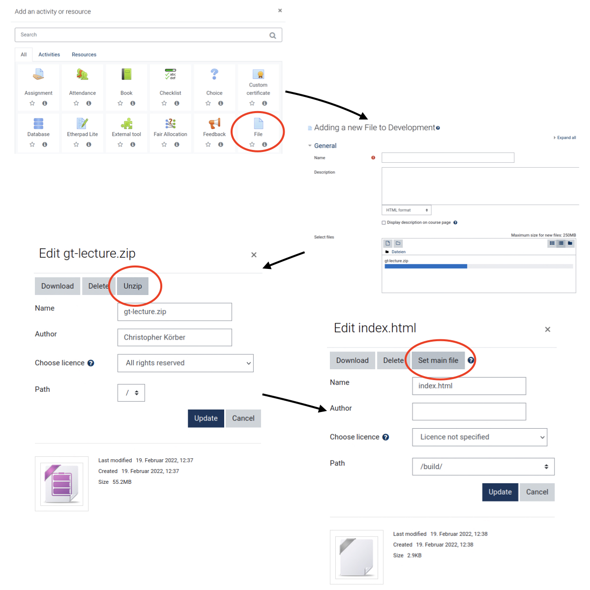

# Moodle integration

Reveal.js integration can be directly embedded into Moodle via the file feature.

## Used tools

* Moodle
* *(Optional)* the `npm` convenience script `npm run zip:prod` uses some bash tools to streamline the creation of a ZIP file needed for the upload.

## Steps

1. Zip the entire reveal.js presentation (including media, static, and HTML files).
2. Create a file tool in the Moodle course and upload the zip.
3. Unzip the uploaded zip folder in the Moodle tool and specify the `index.html` to be the main file.
    The link to this Moodle file resource will now display the presentation.



*Thank you to the [RUB eLearning](https://www.rubel.rub.de/en) support team for the helpful instructions!*


### [Optional] Inline embedding
This resource can also be embedded as an `<iframe>` to be viewed inline.
I.e., create a `Label` resource and add the following HTML
```html
<iframe width="850" height="600" src="https://moodle.{link-to-created-resource}/index.html#/">
  Fallback text here for unsupporting browsers, of which there are scant few.
</iframe>
```


## Scripts

You can also run the
```bash
npm run zip:prod
```
command to compile static files and create a `zip` containing the entire page for the upload.
Depending on the modifications you have introduced, you may have to update the logic.

!!! note
    I am currently trending towards formulating this as a traditional `Makefile`.
